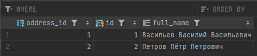
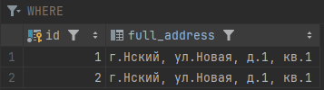
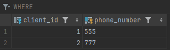

### Создайте класс Client поля:

- id
- имя
- адрес (OneToOne)
```java
class Address {
    private String street;
}
```
- телефон (OneToMany)
```java
class Phone {
    private String number;
}
```
Разметьте классы таким образом, чтобы при сохранении/чтении объекта Client каскадно сохранялись/читались вложенные объекты.

### ВАЖНО.
1. Hibernate должен создать только три таблицы: для телефонов, адресов и клиентов.
2. При сохранении нового объекта не должно быть update-ов.

Посмотрите в логи и проверьте, что эти два требования выполняются.

## Реализация

---

### docker-compose.yml
- Запустит контейнер `otus-lesson28` в группе `lesson28-jpql` (по названию модуля проекта).
- Из папки `/db` запустится скрипт инициализации для создания схемы `lesson28`

Для проверки работоспособности можно запустить тест.

---
Логи
```log
Hibernate: create table lesson28.address (id bigint not null, full_address varchar(255), primary key (id))
Hibernate: create table lesson28.client (address_id bigint unique, id bigint not null, full_name varchar(255), primary key (id))
Hibernate: create table lesson28.phone (client_id bigint, phone_number varchar(255) not null, primary key (phone_number))
Hibernate: alter table if exists lesson28.client add constraint FKb137u2cl2ec0otae32lk5pcl2 foreign key (address_id) references lesson28.address
Hibernate: alter table if exists lesson28.phone add constraint FK3o48ec26lujl3kf01hwqplhn2 foreign key (client_id) references lesson28.client
Hibernate: select nextval('lesson28.client_SEQ')
Hibernate: select nextval('lesson28.address_SEQ')
Hibernate: insert into lesson28.address (full_address,id) values (?,?)
Hibernate: insert into lesson28.client (address_id,full_name,id) values (?,?,?)
Hibernate: insert into lesson28.phone (client_id,phone_number) values (?,?)
Hibernate: select nextval('lesson28.client_SEQ')
Hibernate: select nextval('lesson28.address_SEQ')
Hibernate: insert into lesson28.address (full_address,id) values (?,?)
Hibernate: insert into lesson28.client (address_id,full_name,id) values (?,?,?)
Hibernate: insert into lesson28.phone (client_id,phone_number) values (?,?)
```


---
Таблица клиентов каскадно взаимодействует со связанными таблицами



---
Таблица адресов может хранить дубли адресов



---
Таблица телефонов не может хранить дубли номеров

